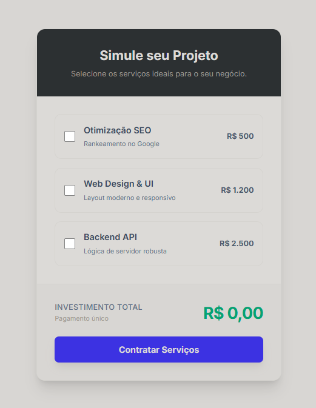

# 💰 Simulador de Orçamento - Pricing UI Component

Este projeto é uma implementação de um componente de interface para **Cotação de Serviços em Tempo Real**. O objetivo foi transformar uma lista de checkboxes padrão HTML em uma experiência de seleção moderna, intuitiva e responsiva, típica de produtos SaaS e Agências Digitais.

## 🎨 Evolução do Design

O projeto foi refatorado seguindo princípios de Design System e Heurísticas de Usabilidade:

### 1. Fundamentos Visuais (Clean UI)

**Paleta de Cores Profissional:**
- **Base:** Slate-50 e White para um visual limpo e arejado.
- **Marca (Brand):** Indigo-600 para indicar interatividade e seleção.
- **Feedback (Success):** Emerald-600 exclusivo para valores monetários e confirmação.

**Elevação:** Uso de sombras suaves (`shadow-xl`) para destacar o card principal do fundo, criando profundidade.

### 2. Hierarquia e Foco

**Tipografia:** Uso da fonte **Inter** para legibilidade máxima em interfaces digitais.

**Destaque Financeiro:** O valor total não é apenas um texto, é o ponto focal da interface (Text-3xl, Bold, Emerald), guiando o olhar do usuário para o resultado da ação.

### 3. Interatividade e "Vida"

**Área de Clique Expandida:** A usabilidade foi melhorada permitindo o clique em todo o cartão do serviço (`label`), não apenas no pequeno quadrado do checkbox.

**Feedback de Estado:**
- **Normal:** Borda cinza suave.
- **Selecionado:** O card ganha borda Indigo e fundo levemente tintado (`bg-indigo-50`), confirmando visualmente a escolha.
- **Hover:** Feedback sutil ao passar o mouse antes de clicar.

### 4. Padrões de UX (Experiência do Usuário)

**Loading State:** Ao clicar em "Contratar", o botão entra em estado de carregamento (spinner), informando ao usuário que o sistema está trabalhando.

**Validação Proativa:** O sistema impede o envio de orçamentos zerados, educando o usuário sobre a necessidade de seleção.

**Feedback Loop:** Após o "envio", uma notificação flutuante (**Toast**) confirma o sucesso da operação, fechando o ciclo de interação.

## 🛠️ Tecnologias Utilizadas

- **HTML5 Semântico**
- **Tailwind CSS** (via CDN): Para estilização utilitária, responsividade e estados interativos (hover/active/focus).
- **JavaScript (Vanilla)**:
  - Manipulação do DOM.
  - API `Intl.NumberFormat` para formatação monetária nativa (BRL).
  - Controle de assincronismo (`setTimeout`) para simular chamadas de rede.

## 🚀 Como Executar

Como este projeto é autocontido em um único arquivo HTML (com Tailwind via CDN), a execução é instantânea:

1. Baixe o arquivo `index.html`.
2. Abra o arquivo diretamente em qualquer navegador moderno (Chrome, Firefox, Edge, Safari).
3. Não é necessário `npm install` ou build steps.

## 🧩 Funcionalidades Lógicas

Além do visual refinado, o componente possui lógica robusta:

- **Cálculo em Tempo Real:** Soma e subtração de valores instantaneamente ao alterar os checkboxes.
- **Formatação de Moeda:** Garante que o usuário sempre veja o formato "R$ 0.000,00" correto.
- **Gestão de Estados:** O JavaScript controla as classes CSS para alternar entre os estilos "ativo" e "inativo" dos cards.
- **Micro-interações:**
  - Animação de entrada do Toast Notification.
  - Bloqueio do botão durante o "envio" para evitar duplo clique.
  - Reset automático do formulário após o sucesso.

## 📂 Estrutura de Arquivos

/
    
    └── index.html # Contém a estrutura, estilos(Tailwind)
    └── script.js # Contém a  lógica (JS) 
    └── README.md # Documentação do projeto 
    └── img/ 
        └── image.png # Screenshot do projeto

---

Desenvolvido com foco em **UI Design** e **Lógica de Frontend**.